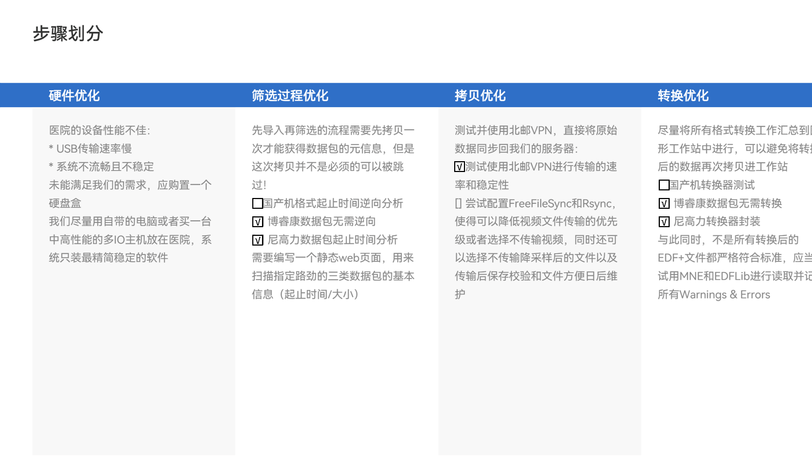
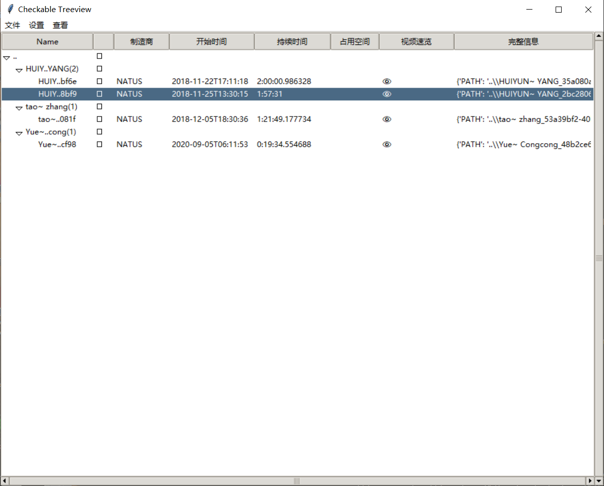

# xuanwu-utils

适用于北京邮电大学-首都医科大学宣武医院脑科学相关合作项目的定制工具



## 主要内容

1. 支持博睿康、尼高力、国产NDRJ三种数据包的扫描GUI工具，用于筛选汇总需要收集的数据包
2. 支持将专有数据格式转换为EDF(+)公开格式的转换器，最好是跨平台的
3. 提供常用CRUD操作的TB级脑电时序数据库

## 配套软件

* 跨平台目录同步软件，需要支持哈希校验、断点续传、图形化界面，可选特性多路并行传输与传输加密

## 筛选工具使用说明

本工具在3.11+的CPython版本上进行了一些简单的手工测试

安装依赖库：

```shell
pip install Edflib-Python pillow av
```

修改Edflib-Python的源代码放宽文件合规要求以读取博睿康不规范的evt.bdf文件！

找到${PYTHON_HOME}\Lib\site-packages\EDFlib\edfreader.py下面几行：

```python
    if self.__datarecords < 1:
      return -13
```

替换为：

```python
    if self.__datarecords < 0:
      return -13
```

运行主程序

```shell
python scaneeg.py
```

可以使用--help了解更多使用方法

### 图形界面说明

*主界面以一个树型视图TreeView展示扫描的结果，下文称其为**扫描树***



* 文件 >> 导出选中项 保存选中的所有叶子节点路径列表为TXT文本
* 文件 >> 导出扫描结果JSON 保存扫描到所有信息使用JSON格式
* 设置 >> 缓存目录 用于设置下述“视频预览”功能的临时图片存放路径
* 查看 >> 展开/折叠所有 提供了一个快速方法用来控制扫描树的展示层级
* “Name”列中括号内的数字有双重含义：叶子节点表示该数据包的标注中有多少条目是*疑似发作条目*，非叶子节点表示有多少个子包
* 双击“占用空间”列会用资源管理器打开该行对应数据包所在的文件夹
* 双击“视频预览”列会打开该行数据包对应的视频速览窗口，目前仅实现多进程加载缩略图功能
* 双击“详细信息”列会打开该行对应的完整扫描结果
* “占用空间”列如果有警告符号⚠，则说明该行对应数据包存在已知损坏（注：具体信息请看标准错误输出，若没有⚠或错误信息输出，数据包依然可能有深度隐藏的损坏点）
* “视频预览”列如果有可视符号👁，则说明该行对应数据包检测到了视频序列，反之则没有

## FreeFileSync对比与同步工具

## 格式转换器说明

### NATUS转换器EdfExport.exe

解压edfexport.zip后请先检查是否已安装依赖项[微软C++运行库2008 32位](vcredist_x86.exe)

【注意事项】当给本转换器指派路径参数时，相对路径要使用POSIX格式即正斜杠作为分隔符，绝对路径不受影响

* 转换单个目录为edf:

```cmd
EDFExport.exe -s "G:\tao~ zhang_********" -edfplus -o D:\脑电组资料
```

*注意如果目录名中包含空格，作为命令行参数需要加引号！*
*不要忘记添加 `-edfplus`！！！*
*如果还想查询更多参数含义及用法，请键入 `EDFExport.exe --help`。*

* 转换多个目录为edf(s):

```cmd
EDFExport.exe -f G:\raw_dir_list.txt -edfplus -o D:\脑电组资料
```

其中 `raw_dir_list.txt`是记录原始文件的目录。

```text
G:\Yue~ Congcong_********
G:\tao~ zhang_********
```

* 转换当前目录的所有子目录为edf(s)：

```cmd
EDFExport.exe -d . -edfplus -o D:\脑电组资料
```

## 数据集规范化流程（草案）

1. 使用 `scaneeg.py`区分原始数据记录与经过剪辑的子记录

* 有些片段对应时间区段重复，应该选取未被裁剪的原始数据作为主要依据！
* 有些发作被重复计数，需要手动整理时仔细甄别！
  以 `***`为例，导出筛选结果 `***_all.json`和 `***_long.txt`

2. 以上一阶段输出的 `***_long.txt`为输入，使用格式转换器进行转码，并将结果归档至 `***_converted`子目录
3. ~~使用 `rclone` + `rclog2md5.py`或者~~ `md5sum`一类的命令生成 `***`的所有内容检验和
4. 更改 `***`访问权限为 `rwxr-xr-x`，所有者为 `root:root`，并移动或者链接至全程数据集总目录
5. 生成plotinfo.json和timeline.html，请参考子目录[rec_quickview_gen](./rec_quickview_gen/README.md)的说明（需要安装可选包）
